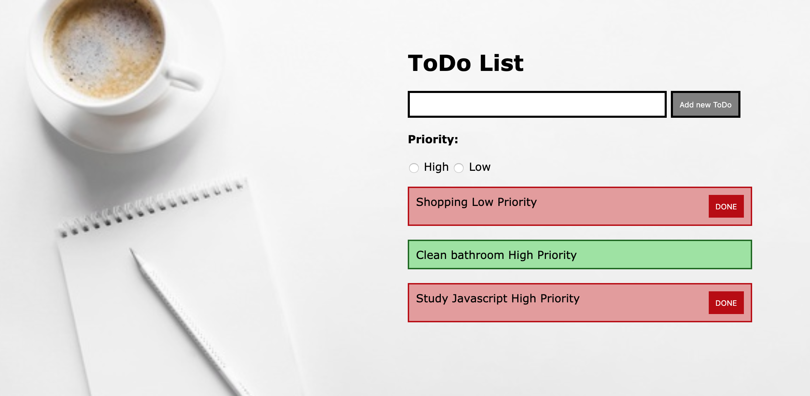
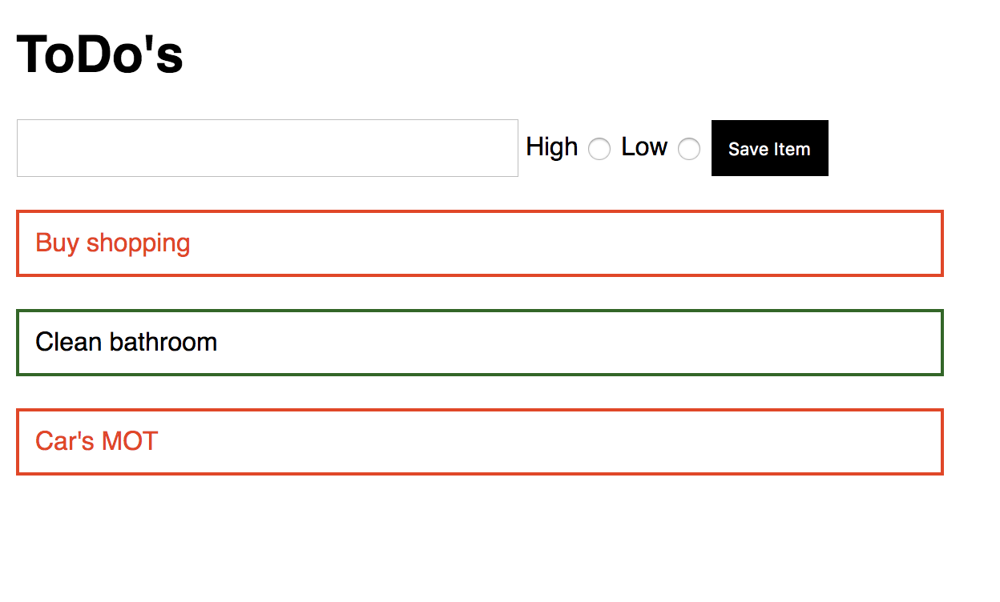

# Homework: ToDo List

## Learning Objectives

- Be able to set up a basic Vue application
- Be able to use forms with `v-model`
- Be able to use `v-on` to manage user events

## Brief

Your task is to create a todo list application that allows a user to save an item to a list which then renders on the page.

Use Vue and Webpack to build a solution that looks like this:

## MVP

- Render a list of todos from an array of strings.  
- Add the capability to add a new todo to the list.

## Extensions

- Update the todos array to take in objects with keys of name and priority.
- Add radio buttons to track the level of priority
- Give the user visual feedback on what todos are high priority

## To view the application running:

download or clone the repository.

In the terminal: cd into the repository folder 

`npm init -y`

`npm i -D webpack webpack-cli`

`npm run build`

`cd public`

`open index.html`
